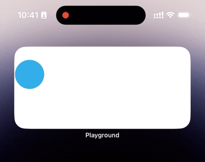

# SwingAnimation
[](https://swift.org/package-manager/)


**SwingAnimation** is a framework allows you to apply smooth animations in widgets.

## Example




```swift
content.swingAnimation(duration: 8, direction: .horizontal, distance: 100)
```

## Requirements

* iOS 14.0+
* Swift 5.8+

## Installation

### Swift Package Manager

```swift
dependencies: [
    .package(url: "https://github.com/TopWidgets/SwingAnimation.git", .upToNextMajor(from: "1.0.0"))
]
```

## Try our App
<a href = "https://apps.apple.com/cn/app/Top-Widgets⁺/id6446477593">
</a>

## License

**SwingAnimation** is available under the MIT license. See the LICENSE file for more info.
